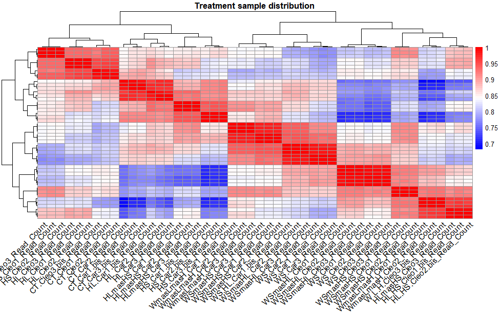
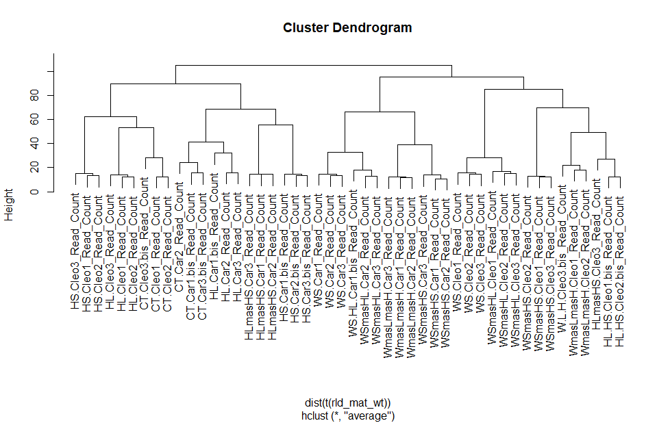
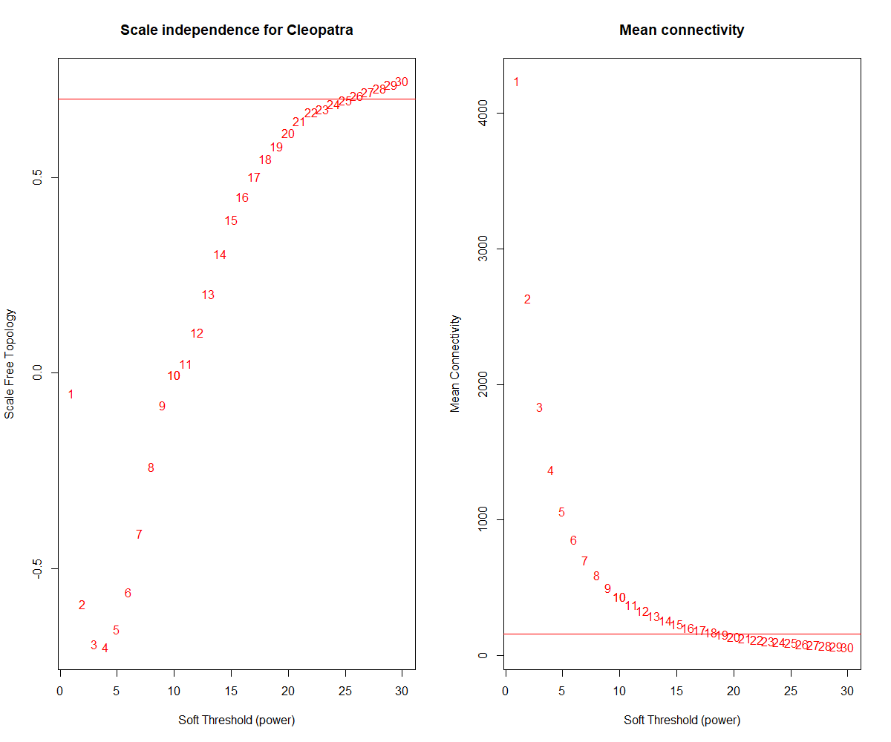
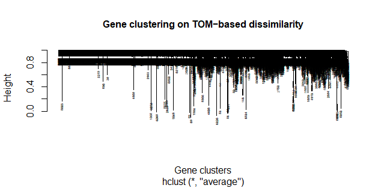
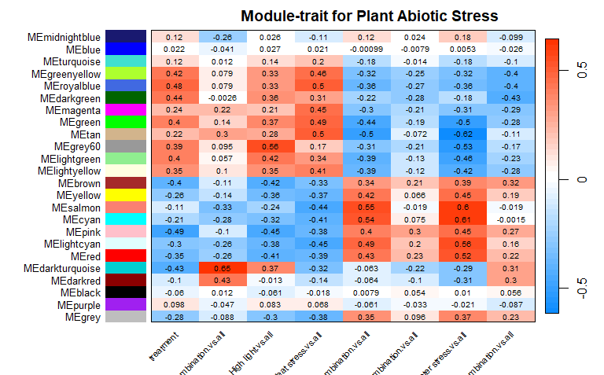
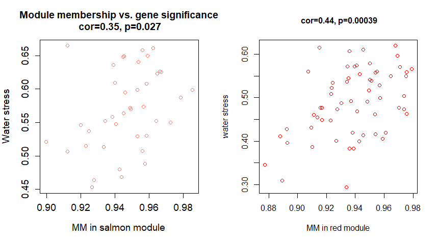

# Differential network analysis to find gene clusters correlated to abiotic stress in plants.

## Introduction
Weighted Correlation Network Analysis (WGCNA) can be used for finding clusters (modules) of highly correlated genes, summarizing such groups using the module eigengene or intramodular hub genes, for relating modules to one another and external sample traits, and calculating module membership measures. It is a type of analysis based on correlating coefficients between different samples. The correlation coefficient is the closest relationship that presents two variables, this is measured in Pearson, Spearman, and Kendal (Chengcheng et al., 2022; Sahai et al., 2018). It is used to evaluate gene expression patterns, where those most like each other are grouped into a module. This relationship also allows associating characteristics, as genes concentrated in a module may be involved in the same biological process or signaling pathway.
Here we use WGCNA to find correlated genes in multiple abiotic stress in plants (Cleopatra Mandarin and Carrizo citrange). We test seven different stress treatments in citrus plants:

1) Water stress (WS)
   
2) High irradiance/light (HL)
   
3) Heat stress (HS)
   
4) High irradiance and heat stress combination (HL + HS)
   
5) Water stress and high irradiance combination (WS + HL)
   
6) Water stress and heat stress combination (WS + HS)
    
7) The combination of water stress, high light, and heat stress (WS +HL +HS).

8) Control (CT)

Therefore, it is reasonable to expect that genes that cluster together in co-expressed modules within the WGCNA analysis would have some similarity in their function or regulation, as they are similarly expressed under these stress conditions. However, due to the conditions, it is expected to find gene modules that overlap to some extent, but there are also significant differences in gene expression between conditions. Also, it is important to consider both gene modules that are common to various conditions and those that are specific to the combinations.

In summary, it is likely to find co-expressed genes in the different abiotic stress conditions, which would suggest similarities in the gene response to these conditions. However, accurate interpretation of the results will require further analysis and consideration of the underlying biology of the experimental conditions being studied.

 ## About the paper 
 
The analysis carried out by Santa‐Catarina, & Gómez‐Cadenas, A. (2022), aimed to study the effect of abiotic stress combinations on the photosynthetic apparatus of two citrus genotypes, Carrizo citrange and Cleopatra mandarina.  Their study showed that the plants were able to increase the expression of genes and proteins related to photosystem repair. 

 ## About the data 
 
The count data and metadata were taken from: Damián Balfagón, Zandalinas, S. I., dos, T., Claudete Santa‐Catarina, & Gómez‐Cadenas, A. (2022). Reduction of heat stress pressure and activation of photosystem II repairing system are crucial for citrus tolerance to multiple abiotic stress combinations. Physiologia Plantarum, 174(6). https://doi.org/10.1111/ppl.13809 and from the Gene Expression Omnibus Data (https://www.ncbi.nlm.nih.gov/geo/query/acc.cgi?acc=GSE203331) 
The data contains 48 samples with 6 biological replicates for each stress condition. You can find the GDC data here (https://www.ncbi.nlm.nih.gov/geo/query/acc.cgi?acc=GSE203331)

## About this analysis 

In this analysis, we took the counting data and metadata to be able to associate the different types of stress with the gene expression of both plant species.  Through this analysis, it was observed that four modules involved in water stress (WH) and water stress combined with irradiation (WS + HL) were shared. 

It was also found that modules such as irradiation with the combination of heat (HL + HS), irradiation (HL), and heat stress (HS), were modules that were associated with plant stress.

Of all the associated traits, WH was significant for both species.  That could mean that this is a relevant trait related to gene co-expression patterns, while other factors did not show such strong correlations with genes.  This suggests that in the dataset the other stresses do not appear to be strongly associated and this could be due to the nature of the data, the sample, the biological context, or the intensity of the effects of each factor on gene expression.  Therefore, this study provides information on the type of stress that could have a more prominent role in the regulation of gene expression in citrus. 


## Methods
The WGCA package has three different ways to perform network construction and module discovery. 
1) An automatic detection of the construction of the network and its modules. This way is convenient for those people who seek to reach a result with minimal effort or with limited computational tools. 
2) A step-by-step construction of the network and module detection. Using this option it is possible to manage and choose our own parameters for the generation of the network and modules. It is also characteristic of not-so-large volumes of expression data. 
3) An automatic way to build block networks and module detection. Special for extremely large gene expression data. It is important to emphasize that this step requires the user to have available multiple cores and a graphical interface with R.  
In this tutorial we build on step 2) to build the network.

In this tutorial, I will present the necessary steps before starting with network construction and module discovery. 
To do this, we will need the packages listed below, to also allow the management of certain cores available on our PC. If you are working from your laptop I recommend you first check the configuration of how many cores your processor handles. In general, it is recommended to use 4 cores, however, I will use only 2. Another step before starting is to use the function (stringsAsFactors = FALSE) in R, which is convenient for handling data frames. R, automatically indicates that matrices should be treated as factorial variables, which can cause your data not to load properly when building or importing it. Therefore, if you do not implement this step your columns containing characters (text) become factors. 

After the construction of the network, we will identify highly related modules and assign them to the phenotypic traits of abiotic stress. We will test whether the associations between gene expression and traits are significant and perform a more in-depth analysis with those modules that are statistically significant.  

 ``` R
#Libraries we are going to use
library(WGCNA);
library(tidyverse);
library(CorLevelPlot);
library(gridExtra);
library(DESeq2);
library(apeglm);
library(ggplot2);  
library(dynamicTreeCut);  
library(flashClust);  
library(lattice);  
library(survival); 
library(Hmisc); 
library(vsn);
library(GEOquery);
library(Pheatmap);

# Allowing only two threads (consult WGCNA packages for more information)
allowWGCNAThreads(2);
ALLOW_WGCNA_THREADS = 2;  
# Initial variables 
Options (stringsAsFactors = FALSE);
enableWGCNAThreads(2)

 ``` 

Subsequently, we will modify our data in such a way that the names of the samples of the counting data are the same as in the metadata. Because our data coming from the GEO Database is not fixed to start the analysis. We will have to modify them and then analyze their gene expression. 

 ``` R
#############################################################################################################################################################
##### DATA MODIFICATION                   ##################################################################################
#############################################################################################################################################################
#Import count data (you can download from the GEO page)
data <- read.table("counts.txt", header=TRUE, sep="\t")

#Delete columns we will not use
colnames(data)

#We are going to use only the genes protein coding.  
data <- filter( data, Type=="protein_coding")
#12 658 coding genes

#Besides, we need only the samples names and the Genes 
data <- select(data, -Feature_GID, -Feature_TID, -Type, -Gene_Symbol,
               -Gene_Synonym, -Protein_ID, -Product)

Data <- Data[, 1:49]
#Now we have the count data !


##### Obtain meta-data ####################

#Load GEO Data Query metadata 
query <-getGEO("GSE203331", GSEMatrix = TRUE)

#Obtain matrix metadata
metadata <-pData(phenoData(query[[1]]))

#Let's Change samples names
colnames(metadata)

#1) Select samples name, geo_accession and treatment information.
metadata <- select(metadata, c("title", "treatment:CH1"))

#2) Change samples name for data sample names

#assign data samples names to nuevos_nombres

nuevos_nombres <- as.vector(colnames(data)[2:49])


# To the metadata$title names 
metadata$title <- nuevos_nombres

#Apply the change
metadata$title <- colnames(data)[2:49]


#Test the position of the correct name 
print(nuevos_nombres)
names <- as.data.frame(nuevos_nombres)
#Complement with the different treatment data
phenodata <- data.frame(
  treatment = c("Control", "Control", "Control", "Control", "Control", 
                "High light and heat stress combination", "High light and heat stress combination", 
                "High light and heat stress combination", "High light and heat stress combination", 
                "High light", "High light", "High light", "High light", "High light", "High light", 
                "High light and heat stress combination", "High light and heat stress combination", 
                "Heat stress", "Heat stress", "Heat stress", "Heat stress", "Heat stress", "Heat stress", 
                "Water stress and high light combination", "Water stress and high light combination", 
                "Water stress and high light combination", "Water stress and high light combination", 
                "Water stress and high light combination", 
                "Water stress and heat stress combination", "Water stress and heat stress combination", 
                "Water stress and heat stress combination", "Water stress and heat stress combination", 
                "Water stress and heat stress combination", "Water stress and heat stress combination", 
                "Water stress", "Water stress", "Water stress", "Water stress", "Water stress", 
                "Water stress and high light combination", 
                "Water stress, high light and heat stress combination", 
                "Water stress, high light and heat stress combination", 
                "Water stress, high light and heat stress combination", 
                "Water stress, high light and heat stress combination", 
                "Water stress, high light and heat stress combination", 
                "Water stress, high light and heat stress combination")
  
  
)

# Join and apply the changes
metadata <- cbind(names, metadata, phenodata)
colnames(metadata)

#Now we have the same samples names
new_data <- select(metadata, "nuevos_nombres", "treatment")
 ``` 

Now that we have modified the count and metadata data to work with WGCA, it is also necessary to modify the metadata and convert it to a binary array with the metadata.  This matrix will allow WGCNA to identify which metadata comes from which sample. For example, not all samples are heat stress, with the matrix with binary data it will be marked with 1 if that sample is heat stress and 0, otherwise. Therefore, it is expected to have a column with the samples and other columns with each of the stress conditions in the plant. 

 ``` R
#Now let's prepare the binary metadata, first we are going to binarize control 
traits <- new_data%>% 
  mutate(treatment = ifelse(grepl('Control', treatment), 1, 0))  
  
#And the rest of the metadata 
new_data$treatment <- factor(new_data$treatment , 
                                              levels = c("Control",
                                                        "High light and heat stress combination",
                                                        "High light",
                                                        "Heat stress",
                                                        "Water stress and high light combination",
                                                        "Water stress and heat stress combination",
                                                        "Water stress",
                                                        "Water stress, high light and heat stress combination"))
#We use binarizecategoricalColumns from WGCNA 
severity.out_1 <- binarizeCategoricalColumns(new_data$treatment,
                                           includePairwise = FALSE,
                                           includeLevelVsAll = TRUE,
                                           minCount = 1)

#Join both data frames
PhenoData <- cbind(traits, severity.out_1)

colnames(PhenoData)

#Verify the number of columns 
Pheno <- rownames_to_column(PhenoData)
PhenoData <- Pheno[,2:10]

#Save R session
save(data, PhenoData,file="matrix_data. RData")    
load("matrix_data. RData")

  ```

Now we have the metadata modified for WGCNA, in the same way we have to make the recommendations of WGCNA with the counting data. According to the library, it is necessary to do a variance stabilization with the Deseq2 package before starting with the creation of the network and identification of modules.  This step is known as gene expression analysis and will serve to verify that the samples are not too dispersed and can harm the analysis, also to eliminate genes with very low counts. Specifically, WGCNA suggests a cleansing of the count and sample data prior to variance stabilization. 

 ``` R
##############################################################
####### Gene Expression Analysis ############

## WGCNA requires the application of variation from Deseq2 library into the data counts
    
#Delete Na from count matriz
data <- na.omit(data)

data <- data %>%
    column_to_rownames(var='Entrez_Gene_ID')

# Create dds (see Deseq2 tutorial for more details)
dds <- DESeqDataSetFromMatrix(countData = data,
                              colData = PhenoData,
                              design = ~1) # not spcifying model

## remove all genes with counts < 10 in more than 90% of samples (48*0.90=43.2)
## suggested by WGCNA on RNAseq FAQ
#https://horvath.genetics.ucla.edu/html/CoexpressionNetwork/Rpackages/WGCNA/faq.html

dds90 <- dds[rowSums(counts(dds) >= 10) > 43 ]
nrow(dds90) # from 12, 657 now we have -> 8,316 coding genes.

# Perform variance stabilization (You can find more info on WGCNA FQ)
dds_norm <- vst(dds90)

# Get normalized counts (transform norm data to WGCNA entry)
norm.counts <- assay(dds_norm) %>% 
  t()


save (dds_norm, norm.counts, file="expression_analysis. RData")
load("expression_analysis. RData")
##############################################################
###### Graphic visualization ############

#Let's visualize the dds_norm and the sample distribution
#Data frame transformation
rld_mat_wt <- Assay(dds_norm)

#Correlation values
vsd_cor_wt <- cor(rld_mat_wt)

###### Heatmap ####################

library(pheatmap)
# Prepare the data
data_for_heatmap <- as.matrix(vsd_cor_wt)

# Convert to character data
annotation_row <- as.character(new_data$treatment)

# Add word spaces
annotation_row_with_spaces <- paste(" ", annotation_row, " ")

# Graphic heatmap 
pheatmap(data_for_heatmap,
         cluster_rows = TRUE,
         cluster_cols = TRUE,
         main="Treatment sample distribution",
         color = colorRampPalette(c("blue", "white", "red"))(50),
         show_rownames = FALSE,
         show_colnames = TRUE,
         row_names_side = "left",
         annotation_colors = "black",
         annotation_names_row = FALSE,
         labels_row = annotation_row_with_spaces,
         fontsize_row = 8, # Adjust the font size of row labels
         fontsize_col = 12, # Adjust the font size of column labels
         angle_col = "45") # Set the angle of column labels to 45 degree

#########################################################################3
## Hclust graphic is another way to verify the sample distribution 
htree <- hclust(dist(t(rld_mat_wt)), method = "average")
plot(htree) 

#We can see the application of the variance over the samples with a boxplot 
boxplot(rld_mat_wt,outline=FALSE, main="After Stabilization", show_colnames = TRUE,
        xaxt="n")
 ``` 





With the heatmap and the hclust we can visualize that the biological samples coincide and are not so far from each other. Therefore, we can continue with the analysis without removing any of the samples. 

Next, we will perform the first WGCA step for the construction of the network. In this step we will build a weighted gene network, for this we will have to choose a threshold potential that corresponds to the similarity of co-expression. The pickSoftThreshold function helps to perform network topology analysis and choose the appropriate similarity.  This first step is vital and we must rely on the best statistical interpretation obtained. 

In total we will have the following indices: 

   **Power, SFT.R.sq, slope truncated,  R.sq mean.k,  median.k.max.k**

**Powers** is the choice of how to visualize the data, in this case we select that we want the results in 30 clusters. So it will show us from 1 to 30 the statistics. It is also the potency that is being evaluated. This is used to transform the gene expression matrix into a similarity matrix that will be used to build the co-expression network.

**Sft.R.sq** measures variation in the similarity matrix, so it can explain the relationships between genes. A high value indicates a better power adjustment and therefore a more precise network.

**Slope:** Presents the slope of the curve. It is used to see how Sft.R.sq increases as the power changes. A high value suggests that Sft.R.sq increases rapidly, i.e. it has an effective potency. It is also important to determine when our network stabilizes. 

**Truncated.R.sa** Determines whether the power is high enough to capture relevant co-expression relationships

**Mean.k (k mean):** Average degree of nodes in the coexpression network built with the specified power. Therefore, it is the connection number that a gene has in the network. The higher, the denser a network would be.

**Median.k** Median degree of nodes in the coexpression network constructed with the specified power. Like the middle k, the median k is the number of connections of a gene in the network (number of genes at that node)

**Mx.k:** maximum degree of network nodes. How connected is the gene to the network? 

 ``` R
##########################################################################################################
###### ANALYSIS OF SCALE FREE TOPOLOGY FOR SOFT-THRESHOLDING
     
##########################################################################################################
 #We pick up 30
powers = c(c(1:10), seq(from =10, to=30, by=1)); 

sft = pickSoftThreshold(norm.counts,
                        dataIsExpr = TRUE,
                        powerVector = powers,
                        corFnc = cor, # cor=Pearson correlation 
                        corOptions = list(use = 'p'), 
                        verbose = 5, # Number of words print during the analysis
                        networkType = "signed"); # "unsigned", "signed", "signed hybrid"

write.table(sft, "results_SFT_corr.txt")

# Plot the results
sizeGrWindow(5, 5)
PAR(MFROW = C(1,2));     
cex1 = 1 # 0.9; #Letter number 
# Scale-free topology fit index as a function of the soft-threshold power
plot(sft$fitIndices[,1], -sign(sft$fitIndices[,3])*sft$fitIndices[,2],xlab="Soft Threshold (power)",
     ylab="Scale Free Topology",
     type="n", main = paste("Scale independence for \n Cleopatra"));
text(sft$fitIndices[,1], -sign(sft$fitIndices[,3])*sft$fitIndices[,2],labels=powers,cex=cex1,col="red");

# Red line corresponds to using an R^2 cut-off
 abline(h=0.70, col="red");  
 
# Mean connectivity as a function of the soft-threshold power
plot(sft$fitIndices[,1], sft$fitIndices[,5],xlab="Soft Threshold (power)",ylab="Mean Connectivity", type="n",main = paste("Mean connectivity"))
text(sft$fitIndices[,1], sft$fitIndices[,5], labels=powers, cex=cex1,col="red")

abline(h=160,col="red");

#We need to select the SoftPower number where the Scale-free topology is more stable. 
softPower = 28;
 ```


As can be seen in the results of the table and in the graphs from power number 28 the network reaches a stabilization and a higher threshold, so we chose that number. 

The next step is to calculate an adjacency matrix and TOM dissimilarity. The adjacency matrix serves to represent the similarity between genes in the co-expression network. Genes with high similarity are connected. On the other hand, TOM dissimilarity measures topological dissimilarity between genes in the network. These calculations help identify gene modules that are strongly connected. The modules to be calculated later are sets of genes that tend to express themselves together and may be involved in related biological pathways or processes. 
Other functions involve selecting threshold parameters checking significance and then performing functional analysis of co-expression modules. 

 ``` R

################################################################################
#### Generating adjacency and TOM based on the selected soft power
#############################################################################################
#Calculate the adjacency matrix
adjacency = adjacency(norm.counts,type = "signed",   
                     power = softPower);
head(adjacency)

# translate the adjacency into TOM and calculate the corresponding dissimilarity
# this action minimize the effects of noise and spurious associations

TOM = TOMsimilarityFromExpr(adjacency,                         
                          TOMType = "signed", 
                          power = softPower);

dissTOM = 1-TOM

save(TOM,dissTOM, softPower,adjacency, file="DissTOM.RData")

load("DissTOM.RData")
 ```

Now we will obtain the modules and each module is automatically assigned by WGCNA to a certain color. Where the gray color represents genes that were not assigned to any module.  

WGCNA asks you for a minimum of modules you want to generate, then assigns the genes to a module, and depending on the parameters as if you choose to cut to a certain similarity (cutHeight) it will generate a number of modules that will be assigned to a color. 

 ``` R
################################################################################
    ##### Module identification using dynamic tree cut 
################################################################################
## Set the minimum module size, I will select 20
minModuleSize = 20;
diff(geneTree$height)

## We chose dissTOM for this analysis because all genes are assigned to some module 
dynamicMods = cutreeDynamic(dendro= geneTree, 
                            distM = dissTOM,   
                            deepSplit=2,   
                            pamRespectsDendro= FALSE,     
                            minClusterSize = minModuleSize)

## when cutHeight not given, for method=="tree" it defaults to 0.99, for method=="hybrid" it ##defaults to 99% of the range between the 5th percentile and the maximum of the joining heights ## on the dendrogram

table(dynamicMods)
write.table(table(dynamicMods), file = "results_dynamicMods.txt", sep = ",", quote = FALSE, row.names = F)

# Convert numeric labels into colors
dynamicColors = labels2colors(dynamicMods)      
sort(table(dynamicColors), decreasing = TRUE)  
#24 diff colors 

write.table(sort(table(dynamicColors), decreasing = TRUE), file = "results_dynamicColors.txt", sep = ",", quote = FALSE, row.names = F)

# Plot the dendrogram and colors underneath
sizeGrWindow(8,6)
plotDendroAndColors(geneTree, dynamicColors, "Dynamic Tree Cut",
                    dendroLabels = FALSE, hang = 0.05,
                    addGuide = TRUE, guideHang = 0.1,
                    cex.main = 1,
                    main = "Gene dendrogram and Module Colors")

save(dynamicMods, dynamicColors, geneTree, file="DynamicMods.RData")
 ```


Now that we have modules assigned to certain colors, we need to identify modules whose expression profile is very similar. This can be done by merging modules and quantifying similarity. To obtain a similarity cut, the DynamicTreeCut function is used, and moduleEigengenes is used to quantify the similarity based on its correlation. 

 ``` R
##### Merging of modules whose expression profiles are very similar
################################################################################

# Calculate eigengenes 
MEList= moduleEigengenes(norm.counts, colors= dynamicColors,
                         excludeGrey = TRUE,
                         softPower = softPower)
# Here are the ME tables by color module
MEs = MEList$eigengenes

# Calculate dissimilarity of module eigengenes
MEDiss = 1-cor(MEs)     
     
# Cluster module eigengenes
METree = hclust(as.dist(MEDiss),method= "average")

save(MEs, MEDiss, METree, file= "Module_Identification.RData")
load("Module_Identification.RData")

# Clustering of module eigengenes visualization
sizeGrWindow(6,14)

## plots tree showing how the eigengenes cluster together
plot(METree, main= "Clustering of module eigengenes", 
     cex.main = 1.2,
     xlab= "", #col.lab="red", cex.lab=1.5,
     ylab = "",
     cex = 0.5, #labels = FALSE
     sub= "");   #cex.main = 1, cex.lab = 1, cex.axis = 1    

abline(h=0.50,col="red");
 ```


The next step is optional and will depend on whether you have many modules. If for example you have 30 or more modules it may be necessary to merge them to obtain a smaller number. This will depend on your own analysis. 

In case it is not necessary to merge your modules, choose a MEDissThres=0.0.  This statistic is a threshold used to define when two modules are considered correlated with each other. This value is set taking into account the following logic: if the dissimilarity between two modules is less than the selected threshold, they are considered correlated and would be grouped as a set of related modules. Therefore, it is a measure of how much difference you are willing to accept between the modules before considering that they are related. 

Next, I will not apply a strict merge for my modules, since I only have 24, but it is recommended that before performing this step you verify how different your modules obtained in the previous step are and whether or not it is worth merging them.

By merging them you will notice that the assigned colors are reduced and others are maintained.

 ``` R
#######  ################################################################################

## We choose a height cut of 0.00
MEDissThres = 0.00

## Plot the cut line into the dendrogram
abline(h=MEDissThres, col = "red")
## Call an automatic merging function
merge = mergeCloseModules(norm.counts, dynamicColors, 
                          cutHeight= MEDissThres, 
                          verbose =3)
merge$dendro
merge$oldDendro
merge$newMEs

## The merged module colors
mergedColors = merge$colors

## Eigengenes of the new merged modules
mergedMEs = merge$newMEs
mergedMEs$MEblack[1:5]

length(mergedMEs)   
sort(table(mergedColors), decreasing = TRUE)
write.table(sort(table(mergedColors), decreasing = TRUE), file = "mergedColors.txt", sep = ",", quote = FALSE, row.names = F)

## plot dendrogram with module colors 
plotDendroAndColors(geneTree, main= "Clustering of MEs", 
                    cbind(dynamicColors, mergedColors), 
                    c("Dynamic Tree Cut", "Merged dynamic"), 
                    dendroLabels = FALSE, 
                    cex.main = 1,
                    hang=0.03, addGuide= TRUE, 
                    guideHang=0.05)

# Reaassign the new variables to the old one 
moduleColors = mergedColors

# Construct numerical labels corresponding to the colors
colorOrder = c("grey", standardColors(50));   # standardColors(50)
moduleLabels = match(mergedColors, colorOrder)-1 # moduleColors
MEs = mergedMEs

save(MEs, moduleLabels, moduleColors, file= "MergedMods.RData")
load("MergedMods.RData.RData")
 ```

Just like the graph above allows you to see which modules were merged. Also, it is possible to graph the TOM matrix through TOMplot, to see the difference between the modules that have been merged. Just keep in mind that graphing TOM, can take a long time and is a bit heavy. So take your time to wait (approximately 20 minutes). 

 ``` R
sort(table(mergedColors), decreasing = TRUE)
#set the DIAGONAL of the dissimilarity to NA 
diag(dissTOM) = NA;

TOMplot(dissTOM,
        geneTree,
        as.character(mergedColors[mergedColors]),
        ColorsLeft = mergedColors,
        terrainColors = TRUE,
        main = "TOM graphic");
  ```

Now that we have the modules that are highly related to each other, we can associate these modules with the traits (metadata) we choose about abiotic stress in the plant. 

 ``` R
##### Correlating treats 
################################################################################

# Define the number of genes and samples
nGenes = ncol(norm.counts)
nSamples = nrow(norm.counts)
## Recalculate MEs with color labels.   
MEs0 = moduleEigengenes(norm.counts, moduleColors)$eigengenes  
MEs = orderMEs(MEs0)


# Link the external values to the correlation matrix
PhenoData <- PhenoData %>%
             column_to_rownames(var="nuevos_nombres")
moduleTraitCor2 = cor(MEs, PhenoData, use= "p")

# Calculates Student asymptotic p-value for given correlations.
moduleTraitPvalue2 = corPvalueStudent(moduleTraitCor2, nSamples)   

# Print correlation and p-value heatmap between modules and traits
#textMatrix2= paste(signif(moduleTraitCor2, 2), " (", signif(moduleTraitPvalue2, 1), ")", sep= "")

# Print just the correlation heatmap between modules and traits.
textMatrix2= paste(signif(moduleTraitCor2, 2))
dim(textMatrix2) = dim(moduleTraitCor2)
sizeGrWindow(9, 12)
PAR(Mar= C(3.5, 10, 2, 1))

# Display the corelation values with a heatmap
labeledHeatmap(Matrix= moduleTraitCor2,
               #xLabels= names(datTraits2),
               xLabels= names(PhenoData),
               yLabels = names(MEs),
               yLabelsPosition = "left",
               yColorWidth = 0.1,
               cex.lab.y = 0.8,
               cex.lab.x = 0.7,
               ySymbols= names(MEs),
               colors= blueWhiteRed(50), 
               textMatrix= (textMatrix2),
               setStdMargins= FALSE,
               cex.text= 0.6,
               main= paste("Module-trait for Plant Abiotic Stress"))

 ```



Now that we have associated traits with modules, it is necessary to understand whether this association is really meaningful. For this, WGCNA quantifies the individual associations with our traits of interest through the GS parameter (gene significance). Each module defines a quantitative measure of belonging to that module (MM, correlation between the eigene module and the gene expression profile) allowing to quantify the similarity of all the genes of the matrix with each module.  Therefore, it is expected that it is not necessary to evaluate all modules for all traits if they turn out to be non-significant. 

Observing the generated heatmap, we can see that traits such as "High light and heat stress" and "water stress", obtained values above 0.5 correlation, so it would be interesting to evaluate their significance (traits) in the modules indicated. 


 ``` R
#### Significative Clusters ####

# Significative values 
MEs0 = moduleEigengenes(norm.counts, moduleColors)$eigengenes
MEs = orderMEs(MEs0)
moduleTraitCor = cor(MEs, norm.counts, use = "p");
moduleTraitPvalue = corPvalueStudent(moduleTraitCor, nSamples)

# P-value and correlation 
textMatrix = paste(signif(moduleTraitCor, 2), " (",
                   signif(moduleTraitPvalue, 1), ")", sep = "");
dim(textMatrix) = dim(moduleTraitCor)
dim(PhenoData)

#############   Intramodular analysis #######

###Water stress
Water_stress = as.data.frame(PhenoData$`data.Water stress.vs.all`);
names(Water_stress) = "Water Stress";

# Name of the modules ###
modNames = substring(names(MEs), 3);
geneModuleMembership = as.data.frame(cor(norm.counts, MEs, use = "p"));        
MMPvalue = as.data.frame(corPvalueStudent(as.matrix(geneModuleMembership), nSamples));#Calculates Student asymptotic p-value for given correlations
names(geneModuleMembership) = paste("MM", modNames, sep="");
names(MMPvalue) = paste("p.MM", modNames, sep="");
geneTraitSignificance = as.data.frame(cor(norm.counts, Water_stress, use = "p"));

GSPvalue = as.data.frame(corPvalueStudent(as.matrix(geneTraitSignificance), nSamples));
names(geneTraitSignificance) = paste("GS.", names(Water_stress), sep="");
names(GSPvalue) = paste("p.GS.", names(Water_stress), sep="");

############## GS y MM  ##############
sizeGrWindow(7, 7);
par(mfrow = c(1, 2))

####    High correlated color modules
module = "salmon"
module = "red"

column = match(module, modNames);
moduleGenes = moduleColors == module;

# Left panel
verboseScatterplot(abs(geneModuleMembership[moduleGenes, column]),
                   abs(geneTraitSignificance[moduleGenes, 1]),
                   xlab = paste("MM in", module, "module"),
                   ylab = "Water stress",
                   main = paste("Module membership vs. gene significance\n"),
                   cex.main = 1.2, cex.lab = 1.2, cex.axis = 1.2, col = module)
# Right panel
verboseScatterplot(abs(geneModuleMembership[moduleGenes, column]),
                   abs(geneTraitSignificance[moduleGenes, 1]),
                   xlab = paste("MM in", module, "module"),
                   ylab = "water stress",
                   cex.main = 1, cex.lab = 1, cex.axis = 1, col = module,
                   abline.color = 1)'''

```





These results indicate that water stress has a significant feature on both species (it is important to mention that each of the other traits was also evaluated with its module, where the genetic significance was GS>0.50 for each trait evaluated).  

A total of 61 genes associated with the red module were found that were significant to water stress.  
With the total number of genes obtained in a new matrix and the initial counting table, the genes were written down to see their functions.  


``` R
 colnames(norm.counts)  
norm.counts[1:5,1:5]# these are all genes included in the analysis

#All genes include in the red module
genes.red <- as.data.frame(colnames(norm.counts)[moduleColors=="red"])
print(genes.red)
#we change the column name to entrez gene ID
colnames(genes.red) <- "Entrez_Gene_ID"

#We match the genes with the original data count
annotation <- merge(genes.red, data, by="Entrez_Gene_ID")
Annotation <- Annotation[1:8]
```

Now we can use the genes in this module for future analysis and to visualize the relationship they have with water stress. 

## Acknowledgment
Tere Parra (2023). GitHub. [https://github.com/Tere-Parra/Finding-genes-correlated-to-abiotic-stress-in-plants.]


## References

•	B. Zhang and S. Horvath. A general framework for weighted gene co-expression network analysis. Statistical Applications in Genetics and Molecular Biology, 4(1): Article 17, 2005

•	Damián Balfagón, Zandalinas, S. I., dos, T., Claudete Santa‐Catarina, & Gómez‐Cadenas, A. (2022). Reduction of heat stress pressure and activation of photosystem II repairing system are crucial for citrus tolerance to multiple abiotic stress combination. Physiologia Plantarum, 174(6). https://doi.org/10.1111/ppl.13809

•	Langfelder, P., & Horvath, S. (2008). WGCNA: an R package for weighted correlation network analysis. BMC Bioinformatics, 9(1). https://doi.org/10.1186/1471-2105-9-559


‌
